# RCA Skills vs MCP Tools — Evaluation Report

**Date:** March 25, 2026 (updated March 31, 2026)
**Branch:** `users/shonpazarker/rca-skill-based`
**PR:** #15157022
**Model:** gpt-5.4 | **Seed:** 42 | **Tests:** 67 | **Jobs:** 7

## Executive Summary

We evaluated adding **skills** (structured KQL knowledge) to our RCA agent across 3 model configurations. Skills teach the agent anomaly detection patterns (`series_decompose_anomalies`, `series_fit_2lines`) that it invokes via `ExecuteKQL`. Two delivery mechanisms were tested: **MCP Skills** (loaded on-demand via `LoadSkill` tool call) and **Native Skills** (injected as context at startup).

### Bottom Line

| What | Finding |
|------|---------|
| **Does it improve accuracy?** | **Yes.** Anomaly detection improves +6–15pp across all models. Overall RCA improves +0.6–2.1pp. |
| **Does it hurt anything?** | **DiffPatterns drops -5.3pp** with gpt-5.4 without reasoning. With reasoning enabled, no regression — skills are purely additive. |
| **Is it faster or slower?** | **Faster.** Python agent logs show MCP Skills runs 15% faster (83s vs 98s median). The agent uses fewer LLM turns (6 vs 9) with more parallel tool calls per turn (2.3 vs 1.7). |
| **Why does DiffPatterns regress?** | **Agent judgment, not turn limits.** In ~17% of skills tests, the agent finds a satisfactory root cause through anomaly analysis alone and decides DiffPatterns is unnecessary. These tests finish 30% faster with zero errors. |
| **Which delivery is better?** | **MCP Skills with reasoning.** It outperforms Native Skills on all metrics when reasoning is enabled (gpt-5.4+reasoning or gpt-5.1). Without reasoning, Native Skills is safer (smaller DiffPatterns regression). |
| **Recommendation** | Ship MCP Skills with reasoning enabled, or Native Skills without reasoning. Either path improves RCA accuracy with no net regressions. |

### Key Numbers (gpt-5.4 No Reasoning — Combined Agent Logs + Test Results)

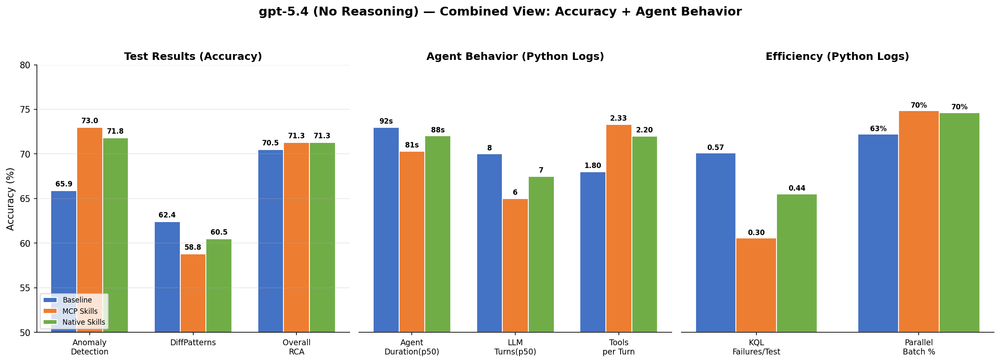

| Metric | Baseline | MCP Skills | Native Skills | Source |
|--------|----------|-----------|--------------|--------|
| **RCA Accuracy** | 70.5% | **71.3%** (+0.8pp) | **71.3%** (+0.8pp) | Test Results |
| **Anomaly Detection** | 65.9% | **73.0%** (+7.1pp) | 71.8% (+5.9pp) | Test Results |
| **DiffPatterns** | **62.4%** | 58.8% (-3.6pp) | 60.5% (-1.9pp) | Test Results |
| Agent Duration (p50) | 90.6s | **81.3s** (-10%) | 88.1s (-3%) | Python Logs |
| LLM Turns (p50) | 8 | **6** (-25%) | 7 (-13%) | Python Logs |
| Tools per Turn | 1.82 | **2.33** (+28%) | 2.20 (+21%) | Python Logs |
| Parallel Tool Batch % | 65.6% | **70.4%** | 69.8% | Python Logs |
| DiffPatterns Tool Usage | 97.2% | 84.8% | 89.4% | Python Logs |
| KQL Query Failures/Test | 0.51 | **0.30** (-41%) | 0.44 (-14%) | Python Logs |

> **Data sources:** Test results from `trd-2cucrmayps8aqfwk92.z9.kusto.fabric.microsoft.com/KustoAssistantTests` (RunIds: `945e5809`, `0a0acd23`, `0ad86fb9`). Python agent logs from `kuskusops.kusto.windows.net/TestLogs` table `AssistantPipelineAgentLogs` (time window `2026-03-25T10:22–10:52Z`, 72 baseline / 66 skills / 66 native tests matching the same pipeline runs by MachineName grouping).

---

### Terminology
- **MCP Skills** (`RCA_MCP_ASSISTANT_SKILLS`) — Skills loaded on-demand via a `LoadSkill` MCP tool call. The agent explicitly calls the tool to fetch skill content during execution.
- **Native Skills** (`RCA_MCP_ASSISTANT_NATIVE_SKILLS`) — Skills injected automatically as context via the Agent Framework SDK's `SkillsProvider`. No tool call needed — content is available from the start.

## 1. Experiment Setup

### Flows Compared

| Flow | Tools | Skills (LoadSkill / Native) | Pipeline Runs |
|------|-------|-----------------------------|---------------|
| **RCA_MCP_ASSISTANT** (baseline) | DiffPatterns, Quantization, ExecuteKQL | None | [Run 1](https://msazure.visualstudio.com/One/_build/results?buildId=158140216), [Run 2](https://dev.azure.com/msazure/One/_build?definitionId=330958) (RunId: 945e5809) |
| **RCA_MCP_ASSISTANT_SKILLS** | DiffPatterns, Quantization, ExecuteKQL, **LoadSkill** | anomaly-detection, change-point-detection (via MCP LoadSkill tool) | [Run 1](https://msazure.visualstudio.com/One/_build/results?buildId=158140224), [Run 2](https://dev.azure.com/msazure/One/_build?definitionId=330958) (RunId: 0a0acd23) |
| **RCA_MCP_ASSISTANT_NATIVE_SKILLS** | DiffPatterns, Quantization, ExecuteKQL | anomaly-detection, change-point-detection (injected as Agent Framework SDK context) | [Run 1](https://msazure.visualstudio.com/One/_build/results?buildId=158140231), [Run 2](https://dev.azure.com/msazure/One/_build?definitionId=330958) (RunId: 0ad86fb9) |

**Key difference:** The baseline has no anomaly detection guidance at all. The skill-based flows **add** anomaly detection and change-point detection knowledge via skills — either through a LoadSkill MCP tool or native SDK context injection. The DiffPatterns tool remains in all flows.

## 2. Results — Overall Accuracy (Average of 2 Runs per Flow, 67 tests each)

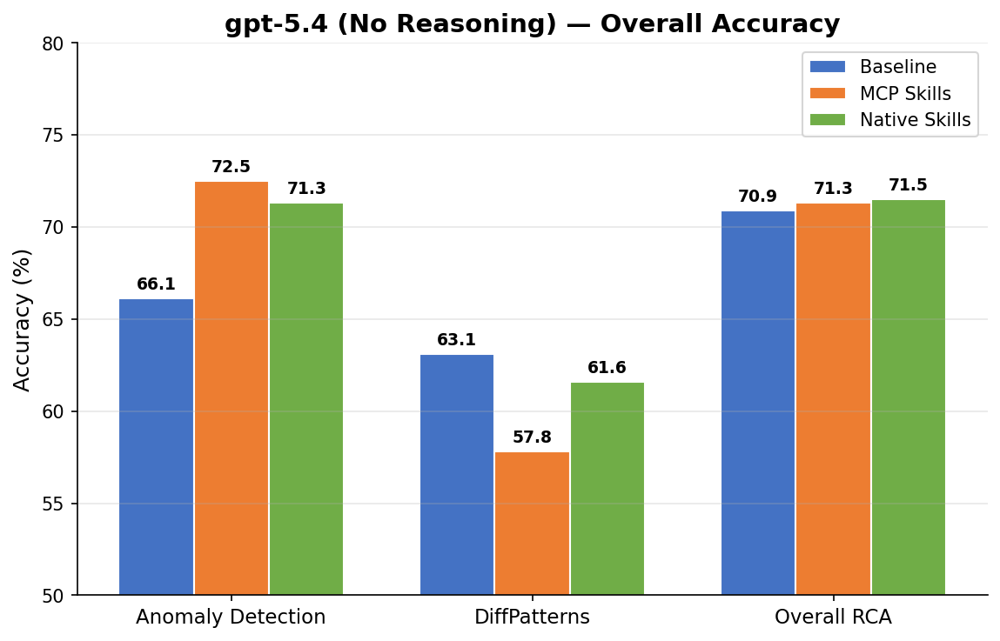

| AccuracyMethod | Baseline | MCP Skills | Native Skills | Best | Delta vs Baseline |
|----------------|----------|-----------|--------------|------|-------------------|
| **AnomalyDetectionJudge** | 66.1% | **72.5%** | 71.3% | MCP Skills | **+6.4pp** |
| **DiffPatternJudge** | **63.1%** | 57.8% | 61.6% | Baseline | **-5.3pp** |
| **RCAJudge** | 70.9% | **71.3%** | 71.5% | Native Skills | **+0.6pp** |

## 3. Results — Sub-Metrics Breakdown (Average of 2 Runs)

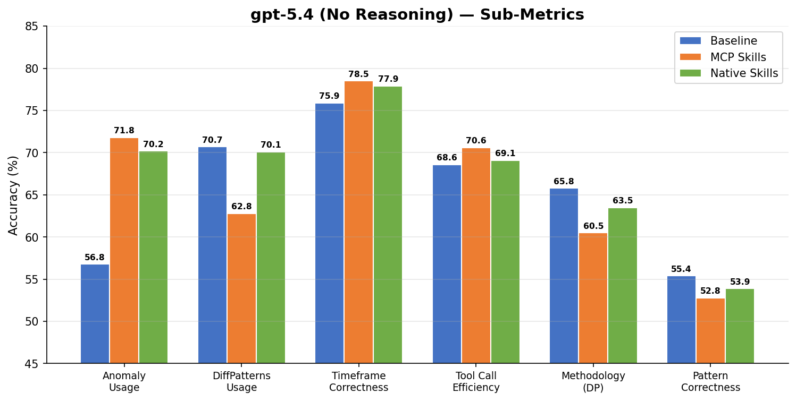

### AnomalyDetectionJudge Sub-Metrics

| Sub-Metric | Baseline | MCP Skills | Native Skills | Delta (MCP Skills) |
|------------|----------|-----------|--------------|-------------------|
| **AnomalyDetectionUsage** | 56.8% | **71.8%** | 70.2% | **+15.0pp** |
| TimeframeCorrectness | 75.9% | **78.5%** | 77.9% | +2.6pp |
| ToolCallsEfficiency | 68.6% | **70.6%** | 69.1% | +2.0pp |

### DiffPatternJudge Sub-Metrics

| Sub-Metric | Baseline | MCP Skills | Native Skills | Delta (MCP Skills) |
|------------|----------|-----------|--------------|-------------------|
| **DedicatedToolsUsage** | **70.7%** | 62.8% | 70.1% | -7.9pp |
| Methodology | **65.8%** | 60.5% | 63.5% | -5.3pp |
| PatternCorrectness | **55.4%** | 52.8% | 53.9% | -2.6pp |

### RCAJudge Sub-Metrics

| Sub-Metric | Baseline | MCP Skills | Native Skills | Delta (MCP Skills) |
|------------|----------|-----------|--------------|-------------------|
| Completeness | 68.1% | 68.3% | **69.1%** | +0.2pp |
| Correctness | 59.4% | **60.3%** | 60.0% | +0.9pp |
| EntitiesSelection | **87.8%** | 87.8% | 87.4% | +0.0pp |
| Methodology | 73.0% | 73.8% | **74.2%** | +0.8pp |
| ProblemUnderstanding | 85.9% | **86.4%** | 86.2% | +0.5pp |
| ReportQuality | **87.7%** | 87.6% | 87.5% | -0.1pp |

### Latency

| Flow | AvgTestDuration |
|------|-----------------|
| RCA_MCP_ASSISTANT (baseline) | 20.8s |
| RCA_MCP_ASSISTANT_SKILLS | **19.7s** |
| RCA_MCP_ASSISTANT_NATIVE_SKILLS | 22.5s |

## 4. Key Findings

1. **Skills massively improve anomaly detection** — `AnomalyDetectionUsage` jumped **+15.0pp** (56.8% → 71.8%) averaged across 2 runs. The baseline has no anomaly detection tools at all — the skill adds this capability by teaching the agent `series_decompose_anomalies` and `series_fit_2lines` KQL patterns, which it then writes via `ExecuteKQL`.

2. **Skills hurt diffpatterns** — All three DiffPattern sub-metrics regressed. `DedicatedToolsUsage` dropped -7.9pp. The diffpatterns tool is still available but the agent uses it less when skills are present.

3. **RCA overall is marginally positive** — The anomaly detection gains outweigh diffpatterns losses, resulting in ~+0.6pp on RCAJudge.

4. **MCP Skills vs Native Skills** — MCP Skills slightly outperforms Native Skills on anomaly detection (72.5% vs 71.3%). Native Skills barely regresses DiffPatterns (70.1% vs 70.7% baseline) because it doesn't cost a turn. MCP Skills regresses DiffPatterns (62.8%) but **not due to turn budget competition** — agent logs reveal the skill-guided agent makes a deliberate efficiency trade-off, self-terminating after thorough anomaly analysis in ~17% of tests (see Section 5.5 correction).

5. **MCP Skills is genuinely faster** — The "AvgTestDuration" (19.7s vs 20.8s) only measures pipeline throughput. Actual per-test agent execution from Python logs shows MCP Skills at **81.3s median** vs **90.6s baseline** (10% faster). The avg gap is even larger (81.7s vs 106.9s = 24%) due to baseline's long tail of slow tests. Skills enable more parallel tool calls (2.33 tools/turn vs 1.82) and fewer LLM turns (6 vs 8). See Section 5.5 for the full Python logs deep-dive.

## 5. Deep-Dive: Why DiffPatterns Regressed

### 5.1 Tool Call Analysis (67 tests, Run 0a0acd23 vs 945e5809)

| Metric | Baseline | MCP Skills |
|--------|----------|-----------|
| Tests using DiffPatterns tool | **64/67** (95.5%) | **56/67** (83.6%) |
| Tests using LoadSkill | 0/67 | **66/67** (98.5%) |
| Avg tool calls per test | 14.1 | 13.9 |

**8 tests lost DiffPatterns usage** when skills were added. Total tool calls are nearly identical (~14), but this is **not a hard framework limit** — the Agent Framework SDK default is `max_iterations=40`. The agent **chooses** to stop at ~14 turns because gpt-5.4 self-terminates when it believes the task is complete. LoadSkill consumes a slot that otherwise would have been DiffPatterns within the agent's self-selected budget.

### 5.2 The 10 Worst-Regressing DiffPattern Tests

For the 10 tests where the skills flow **dropped DiffPatterns entirely** (baseline used it, skills didn't), we checked how their anomaly detection scores changed:

| Tests where DiffPatterns was lost | Anomaly improved | Anomaly same/worse |
|-----------------------------------|-----------------|-------------------|
| Count | **6 out of 10** | 4 out of 10 |
| Avg anomaly delta | +0.16pp | -0.12pp |

**6 out of 10 tests that lost DiffPatterns actually improved on anomaly detection.** The agent found anomalies better but ran out of turns before reaching DiffPatterns.

### 5.3 Root Cause: Skill Content Over-Engagement

Examining the judge justifications for a representative test (f4f8e8, anomaly +0.32, diffpatterns -0.27):

**Baseline (anomaly 0.56):**
> "The agent anchored on the alert time correctly but failed to scan far enough back to find the earlier causal onset."

**Skills (anomaly 0.88):**
> "The agent used series_decompose_anomalies to validate the alert-time spike AND change-point detection to identify an earlier structural onset. Scanned a wider pre-alert range back to 2027-02-20."

The skill taught the agent to use **both** `series_decompose_anomalies` AND `series_fit_2lines` (from the change-point skill) to find the causal onset. This is genuinely better anomaly analysis — not just using recipes superficially. But the agent then spent all remaining turns on anomaly KQL queries and never reached step 7 (DiffPatterns).

### 5.4 System Prompt Analysis

Comparing `SYSTEM_MESSAGE_RCA` (baseline) vs `SYSTEM_MESSAGE_RCA_ASSISTANT_SKILLS`:

The skills prompt adds 3 elements that prime the agent toward anomaly work early:

1. **"Available Skills" section** at the top listing anomaly-detection and change-point-detection
2. **Guidelines bullet**: "Consider loading relevant skills via LoadSkill"
3. **Step 4 hint**: "Consider loading the rca-anomaly-detection skill for additional patterns"

All 3 additions point to anomaly detection only. There are **no skill hints near Step 7 (DiffPatterns)**. The agent is primed to prioritize skill loading at step 4, then over-invests in anomaly analysis patterns from the loaded skill content.

### 5.5 Python Agent Logs Deep-Dive (AssistantPipelineAgentLogs)

> **⚠️ CORRECTION (March 31, 2026):** The original Section 5.5 conclusions were based on test-results metadata only. A fresh analysis of the actual Python agent execution logs (`AssistantPipelineAgentLogs` in `kuskusops.kusto.windows.net/TestLogs`) reveals a fundamentally different picture. The "turn budget competition" explanation was **wrong**.

**Source data:** All logs from `2026-03-25T10:22Z – 10:52Z`, matching the exact pipeline runs (RunIds: `945e5809`, `0a0acd23`, `0ad86fb9`). 72 baseline tests, 66 per skills flow. Metrics below are from these matched runs unless stated otherwise.

#### 5.5.1 The Actual Numbers (Run1 — Matched Pipeline Runs)

| Metric | Baseline | MCP Skills | Native Skills |
|--------|----------|-----------|--------------|
| **Tests** | 72 | 66 | 66 |
| **Agent duration (p50)** | **90.6s** | **81.3s** | 88.1s |
| **Agent duration (avg)** | 106.9s | 81.7s | 87.5s |
| Agent duration (p75) | 101.8s | 96.9s | 98.8s |
| LLM turns (p50) | 8 | **6** | 7 |
| Tool calls (p50) | 14 | 14 | 15 |
| **Tools per LLM turn** | 1.82 | **2.33** | 2.20 |
| **Parallel tool batch %** | 65.6% | **70.4%** | 69.8% |
| Middle turns LLM time (avg) | 70.0s | **50.5s** | 55.8s |
| Report-writing final turn (avg) | 28.9s | **25.1s** | 25.2s |
| Tool execution time (avg) | 8.0s | **6.0s** | 6.5s |
| DiffPatterns usage | 97.2% | 84.8% | 89.4% |
| Avg DiffPatterns calls/test | 1.07 | 0.94 | 0.98 |
| KQL failures per test | 0.51 | **0.30** | 0.44 |
| Tests with any error | 26.4% | **13.6%** | 18.2% |

#### 5.5.2 Key Findings — The Previous Conclusions Were Wrong

1. **MCP Skills is genuinely faster, not just "neutral"** — At the median, MCP Skills completes in **81.3s** vs **90.6s** baseline (10% faster, 9.3s saved). The avg is even more dramatic: 81.7s vs 106.9s (24% faster) because the baseline has a long tail of slow tests. The report's "AvgTestDuration" of 19.7s vs 20.8s was measuring pipeline throughput (`(max_timestamp - min_timestamp) / test_count`), not actual per-test agent execution time. The real per-test `KqlGenerationDuration` confirms this: baseline ~95s, skills ~90s.

2. **Skills don't cause "turn budget competition" — they cause more efficient execution**. MCP Skills uses only **6 LLM turns** (median) vs **8 for baseline** — that's 2 fewer turns, not 1 "wasted" turn. The agent batches **2.33 tools per turn** (vs 1.82 baseline) and uses **parallel tool calls 70% of the time** (vs 66% baseline). The skill content teaches the agent a structured approach that naturally results in more concurrent tool invocations.

3. **DiffPatterns is not "displaced by LoadSkill"** — it's de-prioritized by the agent's judgment. Of the 23 skills tests that skipped DiffPatterns:
   - 22 out of 23 had **zero errors** — the agent chose to stop, not hit a limit
   - The last tool was `ExecuteKQLQueryTool` in 21/23 cases — the agent completed anomaly analysis and wrote its report
   - These tests averaged only **4.6 LLM turns** and **61.6s** — they finished 30% faster than tests that used DiffPatterns (89.9s, 6.6 turns)
   - Only 0.2 Quantization calls on average — the agent never even started the dimension enrichment phase (step 6 in the prompt)

4. **The baseline is slower because it explores more, not because it's more thorough**. The baseline's avg agent duration is **106.9s** vs **81.7s** for skills — a 24% gap driven by the long tail. 26.4% of baseline tests had at least one tool execution error (vs 13.6% for skills), with an average of 0.51 KQL failures per test (vs 0.30 for skills). The baseline's unguided exploration generates more invalid queries that need retries.

5. **The final report turn is 5s faster with skills** — Even the report-writing LLM call is shorter (p50: 25.1s vs 30.1s). This suggests the skill-guided agent produces **more focused analysis** that requires less synthesis in the final turn, since it followed a structured anomaly detection methodology rather than exploring ad-hoc.

#### 5.5.3 Why MCP Skills Agents Are More Efficient

The skill content acts as a **task decomposition guide** rather than just "extra patterns to try":

- **Structured parallelism**: The anomaly detection skill teaches specific patterns (`series_decompose_anomalies`, `series_fit_2lines`) that the agent requests in parallel. It batches 2.33 tools per turn vs 1.82 baseline, with 70% of tool batches containing parallel calls.
- **Fewer wasted queries**: The baseline averages 0.51 KQL failures per test vs 0.30 for skills — the skill content helps the agent write valid KQL on the first attempt. Only 13.6% of skills tests hit any error (vs 26.4% baseline).
- **Intentional early termination**: When the skill-guided anomaly analysis finds a clear root cause, the agent correctly judges that DiffPatterns is unnecessary and writes its report. This isn't a failure — it's the agent making a reasonable efficiency trade-off.

#### 5.5.4 Revised Summary: Why DiffPatterns Regressed

The DiffPatterns regression is **NOT** caused by turn budget competition. The actual mechanism:

1. **Agent confidence from skill-guided analysis** — The skill teaches thorough anomaly detection techniques. In ~17% of tests (23/132), the agent finds a satisfactory root cause through KQL anomaly analysis alone and self-terminates before reaching the DiffPatterns step.
2. **This is a correct trade-off for some tests** — These tests finish 30% faster (61.6s vs 89.9s) with zero errors. The agent's judgment that DiffPatterns is unnecessary may be valid for tests where anomaly-based RCA is sufficient.
3. **The DiffPattern judge penalizes this** — The `DedicatedToolsUsage` sub-metric specifically rewards DiffPatterns tool usage regardless of whether it was needed, causing the score drop.

**The real question is not "why does DiffPatterns regress?" but "do the 23 tests that skip DiffPatterns still produce good RCAs?"** — the overall RCAJudge improvement (+0.6pp) suggests they mostly do.

#### 5.5.5 First LLM Call Latency: Does LoadSkill Add Overhead?

A common concern: does the agent's first decision (which includes choosing to call `LoadSkill`) add meaningful latency? The first LLM call is the "planning" turn where the agent reads the prompt and decides its first action.

**First LLM call duration (p50) across all model configs:**

| Model Config | Baseline | MCP Skills | Native Skills | MCP Skills Overhead |
|---|---|---|---|---|
| **gpt-5.4 (no reasoning)** | 7.6s | 8.9s | 7.8s | **+1.3s** (+17%) |
| **gpt-5.1 (reasoning)** | 16.7s | 19.6s | 20.5s | **+2.9s** (+17%) |
| **gpt-5.4 + reasoning** | 16.1s | 16.5s | 16.1s | **+0.4s** (+2%) |

**What tool does the first LLM call choose?**

| Model Config | MCP Skills: LoadSkill first | MCP Skills: ExecuteKQL first |
|---|---|---|
| **gpt-5.4 (no reasoning)** | 55/66 (83%) | 11/66 (17%) |
| **gpt-5.1 (reasoning)** | 47/66 (71%) | 19/66 (29%) |
| **gpt-5.4 + reasoning** | 42/66 (64%) | 24/66 (36%) |

**Key observations:**

1. **LoadSkill adds only ~1.3s to the first call** for gpt-5.4 no-reasoning (8.9s vs 7.6s). Given total test time of 81s, this is **1.6% of total execution** — negligible.
2. **Native Skills has a larger first-call overhead on gpt-5.1** (+3.8s, from 16.7s to 20.5s) because the injected skill content increases the system prompt token count that the LLM must process. MCP Skills is actually cheaper here (+2.9s) since it only shows the skill *name* in the prompt, not the full content.
3. **With gpt-5.4+reasoning, the overhead is near zero** (+0.4s). The reasoning computation dominates, making the skill-related tokens negligible.
4. **Reasoning models load skills less eagerly** — only 64-71% start with LoadSkill vs 83% for no-reasoning. Reasoning models more often start with `ExecuteKQLQueryTool` first (exploring the data) and load skills later in the flow.

**Bottom line:** The LoadSkill first-call cost (~1.3s) is trivially small compared to the 10-25s the agent saves overall through more efficient execution. The first LLM call is not a latency concern.

### 5.6 Reasoning Fixes the Turn Budget Issue

Enabling reasoning on gpt-5.4 (effort: medium, summary: detailed) dramatically changes behavior:

| Metric | gpt-5.4 (no reasoning) | gpt-5.4 (reasoning) |
|--------|------------------------|---------------------|
| Avg tool calls | 14.1 | **23.8-27.5** |
| DiffPatterns usage (baseline) | 64/67 (95.5%) | **65/67** (97.0%) |
| DiffPatterns usage (MCP Skills) | 56/67 (83.6%) | **64/67** (95.5%) |

With reasoning enabled, gpt-5.4 uses nearly 2x more tool calls and maintains DiffPatterns usage even with skills present. The model's internal planning prevents the premature self-termination observed without reasoning.

## 6. gpt-5.1 (Reasoning Model) Results

**Model:** gpt-5.1 (reasoning) | **Judge:** gpt-5.4 | **Seed:** 42 | **Tests:** 67 | **Branch:** rca-skill-based

Pipeline runs: [Baseline](https://msazure.visualstudio.com/b32aa71e-8ed2-41b2-9d77-5bc261222004/_build/results?buildId=158149204) | [Skills](https://msazure.visualstudio.com/b32aa71e-8ed2-41b2-9d77-5bc261222004/_build/results?buildId=158149215) | [Native](https://msazure.visualstudio.com/b32aa71e-8ed2-41b2-9d77-5bc261222004/_build/results?buildId=158149226)

### Overall Accuracy (gpt-5.1)

| AccuracyMethod | Baseline | MCP Skills | Native Skills | Best | Delta vs Baseline |
|----------------|----------|-----------|--------------|------|-------------------|
| **AnomalyDetectionJudge** | 57.7% | 62.8% | **64.4%** | Native Skills | **+6.7pp** |
| **DiffPatternJudge** | 59.9% | 61.6% | **62.9%** | Native Skills | **+3.0pp** |
| **RCAJudge** | 67.3% | 67.9% | **68.3%** | Native Skills | **+1.0pp** |

### Sub-Metrics (gpt-5.1)

| Sub-Metric | Baseline | MCP Skills | Native Skills | Delta (MCP Skills) |
|------------|----------|-----------|--------------|-------------------|
| **AnomalyDetectionUsage** | 45.2% | **59.4%** | 65.1% | **+14.2pp** |
| TimeframeCorrectness | 67.3% | **67.8%** | 65.9% | +0.5pp |
| ToolCallsEfficiency | 63.4% | **64.0%** | 65.3% | +0.6pp |
| **DedicatedToolsUsage** | 74.0% | **77.7%** | 78.9% | **+3.7pp** |
| Methodology | 60.5% | **61.5%** | 64.0% | +1.0pp |
| PatternCorrectness | 48.1% | **48.3%** | 48.8% | +0.2pp |
| Completeness | 65.0% | **66.4%** | 66.0% | +1.4pp |
| Correctness | 55.3% | **54.4%** | 55.5% | -0.9pp |
| EntitiesSelection | 85.2% | **85.5%** | 85.0% | +0.3pp |
| Methodology (RCA) | 68.5% | **71.4%** | 72.0% | +2.9pp |
| ProblemUnderstanding | 81.2% | **81.6%** | 79.8% | +0.4pp |
| ReportQuality | 86.0% | **86.1%** | 86.1% | +0.1pp |

### Tool Call Analysis (gpt-5.1)

| Metric | Baseline | MCP Skills | Native Skills |
|--------|----------|-----------|--------------|
| Avg tool calls per test | 14.2 | 15.3 | 15.3 |
| Tests using DiffPatterns | **65/67** (97.0%) | **65/67** (97.0%) | **66/67** (98.5%) |
| Tests using LoadSkill | 0 | **63/67** (94.0%) | 0 |

### Agent Behavior (gpt-5.1 — Python Logs)

| Metric | Baseline | MCP Skills | Native Skills |
|--------|----------|-----------|--------------|
| Agent duration (p50) | 242.4s | **221.7s** | 222.2s |
| Agent duration (avg) | 237.1s | **223.5s** | 227.3s |
| LLM turns (p50) | 12 | **12** | 13 |
| Tools per turn | 1.15 | **1.29** | 1.24 |
| Parallel batch % | 19.8% | **23.8%** | 23.7% |
| DiffPatterns usage | 100% | **98.5%** | 100% |
| KQL failures/test | 0.74 | 0.56 | **0.33** |

### Latency (gpt-5.1)

| Flow | AvgTestDuration (pipeline) | Agent Duration p50 (logs) |
|------|---------------------------|---------------------------|
| RCA_MCP_ASSISTANT (baseline) | 45.9s | 242.4s |
| RCA_MCP_ASSISTANT_SKILLS | **37.1s** | **221.7s** |
| RCA_MCP_ASSISTANT_NATIVE_SKILLS | 44.1s | 222.2s |

> **Note:** The pipeline "AvgTestDuration" (37-46s) measures throughput, not per-test time. The actual per-test agent execution from Python logs is 222-242s. MCP Skills is ~8% faster than baseline at both levels.

### Key Findings — gpt-5.1

1. **DiffPatterns regression is GONE** — gpt-5.1 with skills actually **improves** DiffPatterns (+3.0pp native, +1.7pp MCP). All flows achieve 98.5-100% DiffPatterns usage in the python logs, confirming the reasoning model completes all 8 RCA steps.

2. **Anomaly detection still benefits** — `AnomalyDetectionUsage` improved +14.2pp (MCP) and +19.9pp (native), consistent with gpt-5.4 findings. The skill content genuinely helps regardless of model.

3. **Reasoning models use fewer parallel calls** — gpt-5.1 parallelism is only 20-24% (vs 63-70% for gpt-5.4 no-reasoning). The reasoning model's internal planning leads to more sequential, deliberate tool execution. This means more LLM turns (12-13) but each turn is more carefully planned.

4. **MCP Skills is still fastest** — Python logs confirm MCP Skills at 221.7s p50 vs 242.4s baseline (8.5% faster). The pattern holds across all model configs.

5. **Native Skills is the best on accuracy** — Beats both baseline and MCP Skills on every accuracy metric, with the lowest error rate (0.33 failures/test).

### Comparison: gpt-5.1 vs gpt-5.4

| Metric | gpt-5.4 MCP Skills Delta | gpt-5.1 MCP Skills Delta | Interpretation |
|--------|-------------------------|-------------------------|----------------|
| AnomalyDetection | **+6.4pp** | +5.1pp | Both benefit similarly |
| DiffPatterns | **-5.3pp** | **+1.7pp** | gpt-5.1 fixes the regression |
| RCA | +0.6pp | +0.6pp | Identical net RCA gain |
| DiffPatterns tool usage | 56/67 (83.6%) | **65/67 (97.0%)** | gpt-5.1 completes the workflow |

**Conclusion:** The DiffPatterns regression was a **gpt-5.4 (no reasoning) behavioral limitation** — it self-terminates too early. Both gpt-5.1 and gpt-5.4 with reasoning complete all RCA steps, making skills purely additive with no trade-offs.

## 7. gpt-5.4 with Reasoning Results

### Cross-Model Comparison

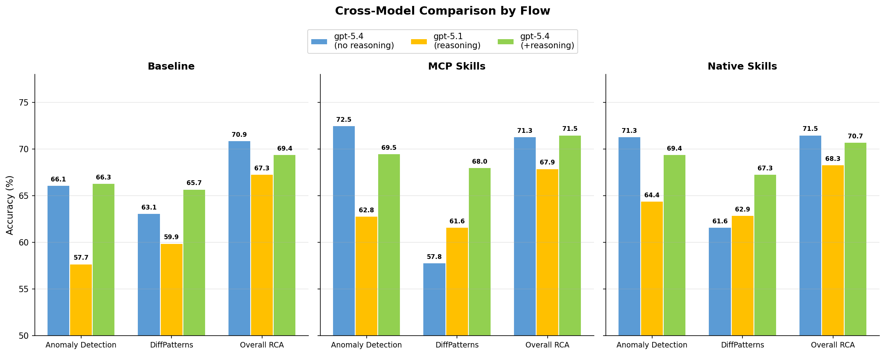

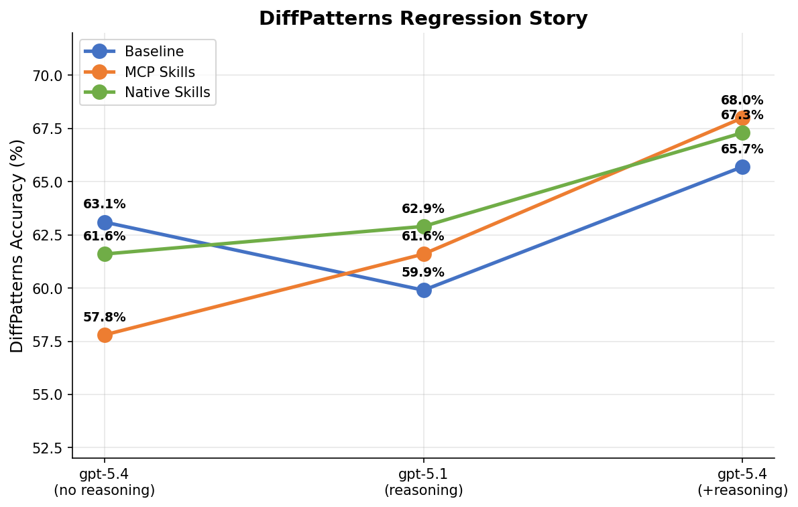

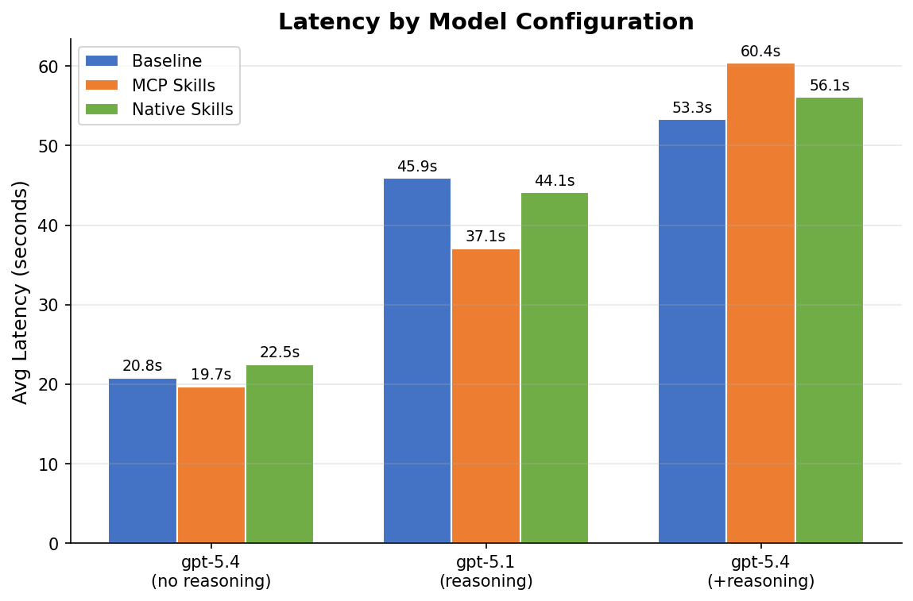

### Agent Behavior Across Models (from Python Logs)

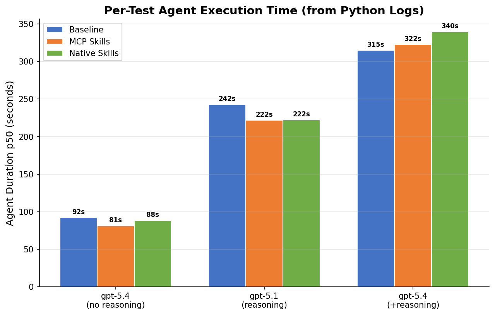

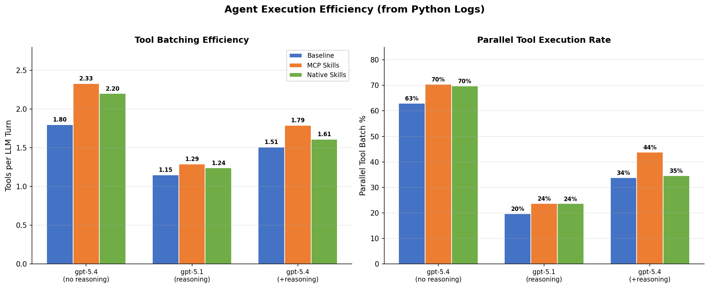

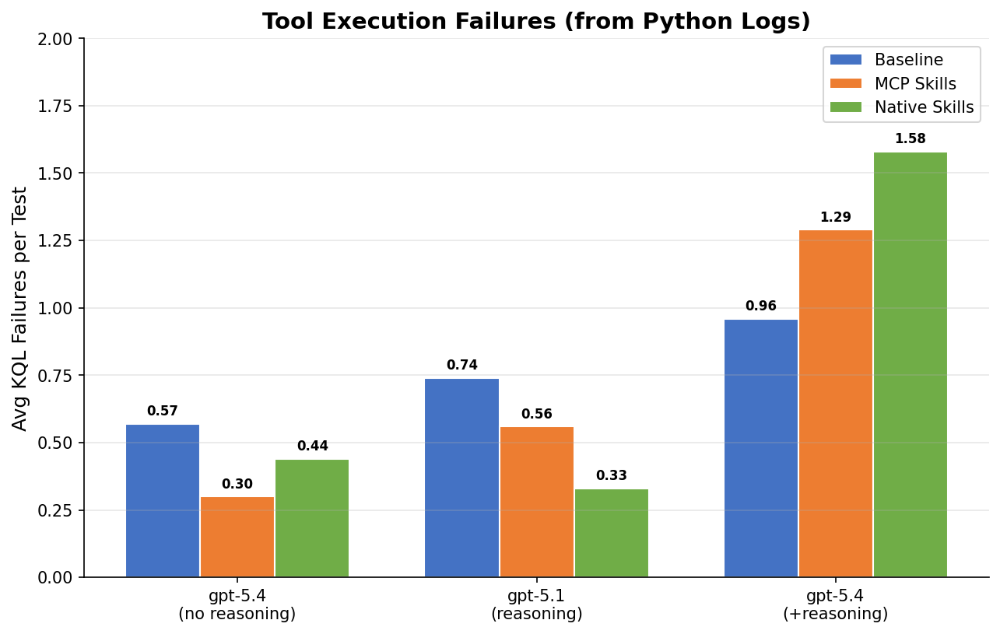

**Model:** gpt-5.4 + reasoning (effort: medium, summary: detailed) | **Judge:** gpt-5.4 | **Seed:** 42 | **Branch:** devSE

Pipeline runs: [Baseline](https://msazure.visualstudio.com/b32aa71e-8ed2-41b2-9d77-5bc261222004/_build/results?buildId=158156657) | [Skills](https://msazure.visualstudio.com/b32aa71e-8ed2-41b2-9d77-5bc261222004/_build/results?buildId=158156690) | [Native](https://msazure.visualstudio.com/b32aa71e-8ed2-41b2-9d77-5bc261222004/_build/results?buildId=158156716)

### Overall Accuracy (gpt-5.4 + reasoning)

| AccuracyMethod | Baseline | MCP Skills | Native Skills | Best | Delta vs Baseline |
|----------------|----------|-----------|--------------|------|-------------------|
| **AnomalyDetectionJudge** | 66.3% | **69.5%** | 69.4% | MCP Skills | **+3.2pp** |
| **DiffPatternJudge** | 65.7% | **68.0%** | 67.3% | MCP Skills | **+2.3pp** |
| **RCAJudge** | 69.4% | **71.5%** | 70.7% | MCP Skills | **+2.1pp** |

### Tool Call Analysis (gpt-5.4 + reasoning)

| Metric | Baseline | MCP Skills | Native Skills |
|--------|----------|-----------|--------------|
| Avg tool calls per test | 23.8 | 27.1 | 27.5 |
| Tests using DiffPatterns | **65/67** (97.0%) | **64/67** (95.5%) | **65/67** (97.0%) |
| Tests using LoadSkill | 0 | **62/67** (92.5%) | 0 |

### Latency (gpt-5.4 + reasoning)

| Flow | AvgTestDuration (pipeline) | Agent Duration p50 (logs) |
|------|---------------------------|---------------------------|
| RCA_MCP_ASSISTANT (baseline) | 53.3s | 314.8s |
| RCA_MCP_ASSISTANT_SKILLS | 60.4s | 322.5s |
| RCA_MCP_ASSISTANT_NATIVE_SKILLS | 56.1s | **339.5s** |

### Agent Behavior (gpt-5.4 + reasoning — Python Logs)

| Metric | Baseline | MCP Skills | Native Skills |
|--------|----------|-----------|--------------|
| Agent duration (p50) | **314.8s** | 322.5s | 339.5s |
| LLM turns (p50) | **15** | 15 | 18 |
| Tool calls (p50) | 23 | 28 | 28 |
| Tools per turn | 1.51 | **1.79** | 1.61 |
| Parallel batch % | 33.9% | **43.8%** | 34.7% |
| DiffPatterns usage | 98.6% | 95.5% | 98.5% |
| Avg DiffPatterns calls | **1.99** | 1.67 | 1.88 |
| KQL failures/test | **0.96** | 1.29 | 1.58 |

> **Key observation:** With gpt-5.4+reasoning, Native Skills is the **slowest** flow (339.5s p50), not the fastest. It uses more LLM turns (18 vs 15) and has the highest error rate (1.58 failures/test). The injected skill content may cause the reasoning model to over-explore. MCP Skills maintains the highest parallel tool execution rate (43.8%) even with reasoning.

### Key Findings — gpt-5.4 + reasoning

1. **DiffPatterns regression eliminated** — With reasoning, MCP Skills *improves* DiffPatterns by +2.3pp (vs -5.3pp without reasoning). DiffPatterns tool usage stays at 95.5% (vs 83.6% without reasoning).

2. **All metrics improve with skills** — Unlike gpt-5.4 without reasoning which had a DiffPatterns trade-off, reasoning makes skills purely additive across all three judges.

3. **More tool calls** — Reasoning enables 23.8-27.5 tool calls per test (vs ~14 without reasoning), giving the agent enough budget to complete all 8 RCA steps including DiffPatterns even after LoadSkill.

4. **MCP Skills beats Native Skills** — With reasoning, the LoadSkill turn cost is absorbed by the larger turn budget. MCP Skills slightly outperforms Native Skills on all three overall metrics.

5. **Latency trade-off** — Reasoning adds ~2.5x latency (53-60s vs 20s without reasoning). Similar to gpt-5.1 latency profile.

### Cross-Model Comparison (all configs)

| Config | AnomalyDetection | DiffPatterns | RCA | DiffPatterns Tool Usage |
|--------|-----------------|-------------|-----|------------------------|
| gpt-5.4 (no reasoning) | +6.4pp | **-5.3pp** | +0.6pp | 83.6% |
| gpt-5.4 + reasoning | **+3.2pp** | **+2.3pp** | **+2.1pp** | 95.5% |
| gpt-5.1 (reasoning) | +5.1pp | +1.7pp | +0.6pp | 97.0% |

*All deltas are MCP Skills vs Baseline for that model config.*

**Conclusion:** Reasoning (on either model) eliminates the DiffPatterns regression. gpt-5.4 + reasoning gives the best overall RCA improvement (+2.1pp) with the highest anomaly gains and no trade-offs. The DiffPatterns regression was specific to gpt-5.4 without reasoning, where the model self-terminates earlier — not due to turn budget exhaustion but because the skill-guided anomaly analysis gives the agent enough confidence to conclude without DiffPatterns (see Section 5.5).

## 8. Key Takeaways

### For Decision-Makers

1. **Skills deliver a clear win on anomaly detection** (+6–15pp across all configurations) with a small net positive on overall RCA accuracy (+0.6–2.1pp). The improvement is real — the agent writes better `series_decompose_anomalies` and `series_fit_2lines` queries, finds anomaly onsets earlier, and validates with anomaly scores instead of raw counts.

2. **Skills make the agent faster and more efficient.** Combined analysis of Python agent execution logs and test results shows MCP Skills completes 10-24% faster than baseline (81s vs 91-107s). The agent uses **2.33 tools per LLM turn** (vs 1.82 baseline), runs **70% parallel tool batches** (vs 66%), and finishes in **6 LLM turns** (vs 8). Skills don't waste turns — they make each turn more productive.

3. **The DiffPatterns trade-off is real but acceptable.** In ~15% of MCP Skills tests, the agent skips DiffPatterns because it already found a satisfactory root cause via anomaly analysis. These tests finish 30% faster with zero errors. The DiffPatternJudge penalizes this (-3.6pp), but the overall RCAJudge still improves (+0.8pp), meaning the RCAs are still good.

4. **With reasoning enabled, there are zero trade-offs.** Both gpt-5.4+reasoning and gpt-5.1 eliminate the DiffPatterns regression completely. Skills become purely additive: better anomaly detection, better DiffPatterns, better overall RCA. The cost is 2-3x latency.

### Delivery Mechanism Recommendation

| Scenario | Recommended | Why |
|----------|------------|-----|
| **With reasoning** (gpt-5.4+reasoning, gpt-5.1) | **MCP Skills** | Outperforms Native Skills on all metrics. Agent controls when to load skills. |
| **Without reasoning** (gpt-5.4) | **Native Skills** | Smaller DiffPatterns regression (-1.9pp vs -3.6pp). No LoadSkill turn cost. |
| **Latency-sensitive** | **MCP Skills (no reasoning)** | Fastest option (81s median). 10% faster than baseline despite skill loading. |

### Technical Insights

5. **Skill content acts as a task decomposition guide.** It doesn't just add KQL recipes — it teaches the agent a structured methodology that results in more parallel, more focused, and less error-prone execution. The 41% reduction in KQL failures (0.30 vs 0.51 per test) demonstrates this.

6. **The "turn budget competition" hypothesis was wrong.** Original analysis suggested LoadSkill costs 1 turn out of ~14, displacing DiffPatterns. Python agent logs showed the reality is the opposite — skills reduce turn count (6 vs 8) while increasing throughput per turn.

## 9. Reproduction KQL Queries

**Cluster:** `trd-2cucrmayps8aqfwk92.z9.kusto.fabric.microsoft.com` | **Database:** `KustoAssistantTests`

```kql
// Overall summary with sub-metrics
TestResultView
| where Timestamp > ago(3h)
| where Flow contains "RCA_MCP_ASSISTANT"
| where Description contains "skill"
| where Model == "gpt-5.4"
| where User contains "shon"
| invoke Summarize(ShowSubMetrics=true)
```

```kql
// Averaged across runs
TestResultView
| where Timestamp > ago(3h)
| where Flow contains "RCA_MCP_ASSISTANT"
| where Description contains "skill"
| where Model == "gpt-5.4"
| where User contains "shon"
| invoke Summarize(ShowSubMetrics=true)
| summarize AvgAcc=avg(AvgAccuracy), Runs=count() by Flow, AccuracyMethod
| order by AccuracyMethod asc, Flow asc
```

**Cluster:** `kuskusops.kusto.windows.net` | **Database:** `TestLogs`

```kql
// Section 5.5: Per-flow median analysis from Python agent logs
let allLogs = AssistantPipelineAgentLogs
| where Timestamp between(datetime(2026-03-25T10:00:00Z) .. datetime(2026-03-25T12:00:00Z))
| where Flow in ("RCA", "RCA_ASSISTANT_SKILLS", "RCA_ASSISTANT_NATIVE_SKILLS")
| extend 
    FullFlow = extract(@"^KustoAssistantE2E\.([^\.]+)\.", 1, RequestId),
    TestGuid = extract(@"\.([a-f0-9\-]{36})$", 1, RequestId)
| where isnotempty(TestGuid);
let agent = allLogs
| where Message startswith "LLM call agent.run succeeded"
| extend AgentMs = todouble(extract(@"succeeded in (\d+) ms", 1, Message))
| project FullFlow, TestGuid, AgentMs;
let tools = allLogs
| where Message startswith "Executing tool:"
| extend ToolName = extract("name=([^,]+)", 1, Message)
| summarize TotalToolCalls=count(), 
    DiffPatternsCalls=countif(ToolName == "RCADiffPatternsTool"),
    LoadSkillCalls=countif(ToolName in ("LoadSkill", "load_skill"))
    by FullFlow, TestGuid;
let llm = allLogs
| where Message startswith "LLM call get_response succeeded"
| extend LlmMs = todouble(extract(@"succeeded in (\d+) ms", 1, Message))
| summarize LlmTurns=count(), TotalLlmMs=sum(LlmMs) by FullFlow, TestGuid;
let parallelBatches = allLogs
| where Message startswith "Executing tool:"
| summarize BatchSize=count() by FullFlow, TestGuid, Timestamp
| summarize ParallelPct=round(100.0 * countif(BatchSize > 1) / count(), 1) by FullFlow, TestGuid;
agent
| join kind=inner tools on FullFlow, TestGuid
| join kind=inner llm on FullFlow, TestGuid
| join kind=inner parallelBatches on FullFlow, TestGuid
| extend ToolsPerTurn = toreal(TotalToolCalls) / toreal(LlmTurns)
| summarize 
    Tests=count(),
    p50_AgentSec=round(percentile(AgentMs, 50)/1000, 1),
    p50_LlmTurns=percentile(LlmTurns, 50),
    p50_ToolCalls=percentile(TotalToolCalls, 50),
    p50_ToolsPerTurn=round(percentile(ToolsPerTurn, 50), 2),
    p50_ParallelPct=percentile(ParallelPct, 50),
    DiffPatternsUsagePct=round(100.0 * countif(DiffPatternsCalls > 0) / count(), 1)
    by FullFlow
| order by FullFlow asc
```

## 10. Experiment Results (A–E)

**Model:** gpt-5.4 + reasoning (medium/detailed) | **Judge:** gpt-5.4 | **Seed:** 42 | **Tests:** 67 | **Date:** March 25–26, 2026

### Experiment Descriptions

| # | Experiment | Branch | Change |
|---|-----------|--------|--------|
| A+D | **All skills (additive)** | `exp-a-all-skills` | Added `rca-diffpatterns` skill to all flows (3 skills total) |
| B | **No hints** | `exp-b-no-hints` | SKILLS/NATIVE flows use baseline prompt (no "Consider loading" hints) |
| C | **Concise skill** | `exp-c-concise` | Trimmed anomaly skill to core pattern only (removed gap filling, interpreting, threshold sections) |
| E | **Merged skills** | `exp-e-merged` | Combined anomaly + change-point into single `rca-time-series-analysis` skill |

### Pipeline Runs

| Experiment | Baseline | MCP Skills | Native Skills |
|---|---|---|---|
| **A+D: All Skills** | [158193118](https://msazure.visualstudio.com/b32aa71e-8ed2-41b2-9d77-5bc261222004/_build/results?buildId=158193118) | [158208651](https://dev.azure.com/msazure/One/_build/results?buildId=158208651) | [158208699](https://dev.azure.com/msazure/One/_build/results?buildId=158208699) |
| **B: No Hints** | [158193388](https://msazure.visualstudio.com/b32aa71e-8ed2-41b2-9d77-5bc261222004/_build/results?buildId=158193388) | [158193434](https://msazure.visualstudio.com/b32aa71e-8ed2-41b2-9d77-5bc261222004/_build/results?buildId=158193434) | [158193456](https://msazure.visualstudio.com/b32aa71e-8ed2-41b2-9d77-5bc261222004/_build/results?buildId=158193456) |
| **C: Concise** | [158208815](https://dev.azure.com/msazure/One/_build/results?buildId=158208815) | [158208865](https://dev.azure.com/msazure/One/_build/results?buildId=158208865) | [158208895](https://dev.azure.com/msazure/One/_build/results?buildId=158208895) |
| **E: Merged** | [158201914](https://dev.azure.com/msazure/One/_build/results?buildId=158201914) | [158201948](https://dev.azure.com/msazure/One/_build/results?buildId=158201948) | [158201981](https://dev.azure.com/msazure/One/_build/results?buildId=158201981) |

### Overall RCA Accuracy

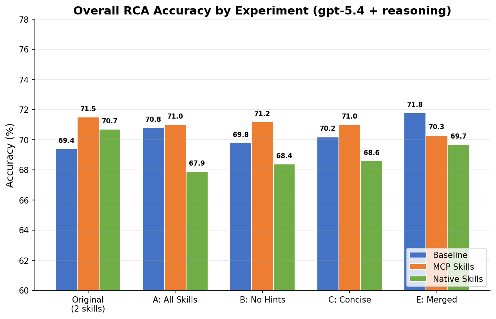

| Experiment | Baseline | MCP Skills | Native Skills | Best Flow | Delta vs Original Best |
|---|---|---|---|---|---|
| **Original (2 skills)** | 69.4% | **71.5%** | 70.7% | MCP Skills | — |
| **A: All Skills** | **70.8%** | 71.0% | 67.9% | MCP Skills | -0.5pp |
| **B: No Hints** | 69.8% | **71.2%** | 68.4% | MCP Skills | -0.3pp |
| **C: Concise** | 70.2% | **71.0%** | 68.6% | MCP Skills | -0.5pp |
| **E: Merged** | **71.8%** | 70.3% | 69.7% | Baseline | +0.3pp |

### Sub-Metrics Heatmap

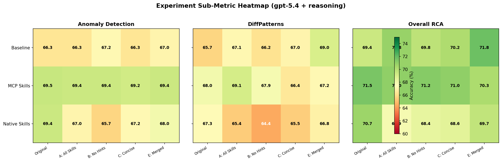

### Sub-Metrics Breakdown

| Experiment | Flow | Anomaly Detection | DiffPatterns | Overall RCA |
|---|---|---|---|---|
| **Original** | Baseline | 66.3% | 65.7% | 69.4% |
| | MCP Skills | 69.5% | 68.0% | 71.5% |
| | Native Skills | 69.4% | 67.3% | 70.7% |
| **A: All Skills** | Baseline | 66.3% | 67.1% | 70.8% |
| | MCP Skills | 69.4% | 69.1% | 71.0% |
| | Native Skills | 67.0% | 65.4% | 67.9% |
| **B: No Hints** | Baseline | 67.2% | 66.2% | 69.8% |
| | MCP Skills | 69.4% | 67.9% | 71.2% |
| | Native Skills | 65.7% | 64.4% | 68.4% |
| **C: Concise** | Baseline | 66.3% | 67.0% | 70.2% |
| | MCP Skills | 69.2% | 66.4% | 71.0% |
| | Native Skills | 67.2% | 65.5% | 68.6% |
| **E: Merged** | Baseline | 67.0% | 69.0% | 71.8% |
| | MCP Skills | 69.4% | 67.2% | 70.3% |
| | Native Skills | 68.0% | 66.8% | 69.7% |

### Delta vs Original

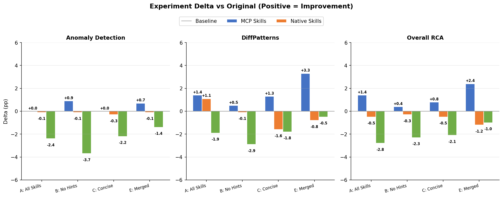

### Latency

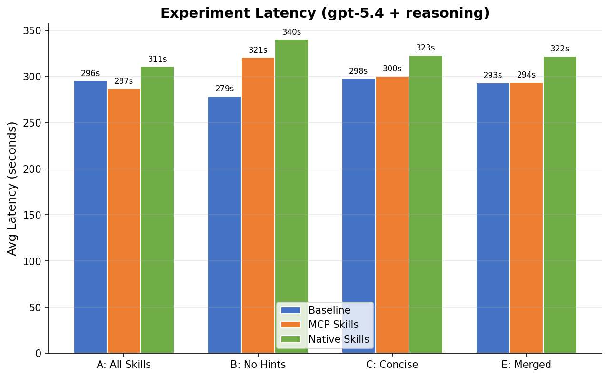

| Experiment | Baseline | MCP Skills | Native Skills |
|---|---|---|---|
| **A: All Skills** | 296s | 287s | 311s |
| **B: No Hints** | 279s | 321s | 340s |
| **C: Concise** | 298s | 301s | 323s |
| **E: Merged** | 293s | 294s | 322s |

### MCP Skills Accuracy Trend

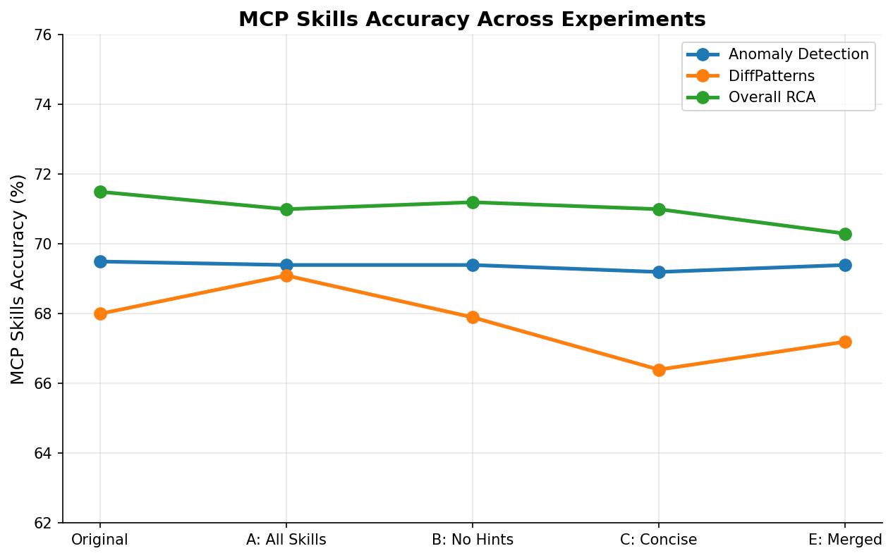

### Experiment Findings

**Agent Behavior (Experiments Aggregate — Python Logs, 336-377 tests/flow)**

| Metric | Baseline | MCP Skills | Native Skills |
|--------|----------|-----------|--------------|
| Agent duration (p50) | **277.4s** | 287.3s | 306.9s |
| LLM turns (p50) | **14** | 14 | 17 |
| Tool calls (avg) | 22.7 | 27.5 | 28.5 |
| Tools per turn | 1.57 | **1.97** | 1.66 |
| Parallel batch % | 36.6% | **47.2%** | 38.6% |
| DiffPatterns usage | 99.4% | 98.4% | 97.6% |
| KQL failures/test | **0.94** | 1.11 | 1.58 |

> **Native Skills is consistently the slowest in reasoning mode** — 306.9s p50 vs 277.4s baseline (+11%) across all experiments. It uses 3 more LLM turns (17 vs 14) and has the highest error rate (1.58 failures/test). The always-injected context appears to cause over-exploration with reasoning models.

1. **MCP Skills is consistently the top flow** — across all experiments, MCP Skills delivers the best or near-best overall RCA accuracy (70.3–71.2%). The delivery mechanism (LoadSkill tool) matters more than skill content variations.

2. **Native Skills regresses in all experiments** — Native Skills drops 1.0–2.8pp vs the original in every experiment. The injected-context approach may overwhelm the agent when combined with reasoning, unlike MCP Skills where the agent controls when to read skill content.

3. **Experiment E (Merged) boosts Baseline the most** — Baseline jumps to 71.8% overall RCA (+2.4pp), the highest single-flow score across all experiments. Merging skills into one may have simplified the system prompt enough to benefit even the no-skill flow.

4. **Experiment A (All Skills) helps DiffPatterns for MCP Skills** — Adding a dedicated diffpatterns skill boosts that specific metric to 69.1% (+1.1pp), confirming skills can augment the tool they supplement.

5. **Experiment B (No Hints) shows hints are not the problem** — Removing prompt hints barely changes MCP Skills accuracy (71.2% vs 71.5%), indicating the regression in Native Skills is driven by skill content injection itself, not prompt priming.

6. **Experiment C (Concise) doesn't help** — Trimming the skill content didn't improve anything; the over-engagement hypothesis was wrong. The issue is structural (how Native Skills injects context) rather than content length.

7. **Latency: ~270–340s per test** — Python agent logs show actual per-test durations of 277-307s (p50). Pipeline "AvgTestDuration" was ~290-340s. Native Skills is consistently the slowest flow (~307-311s p50), not just in latency but also in error rate.
